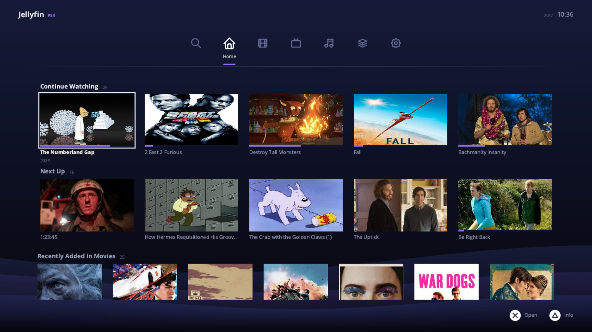
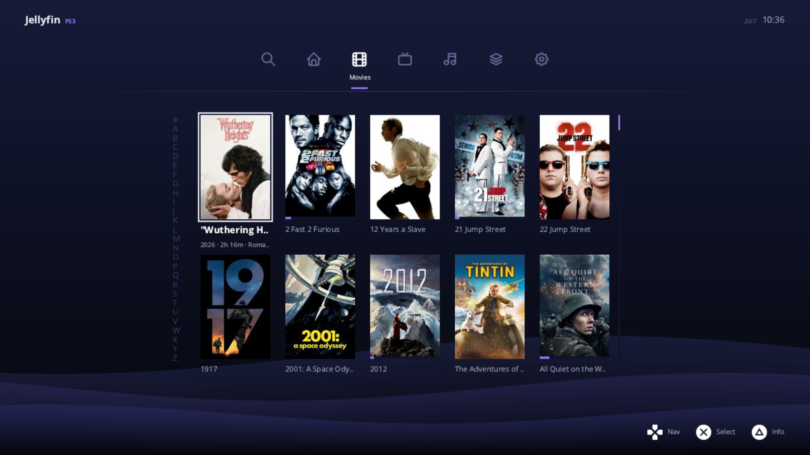
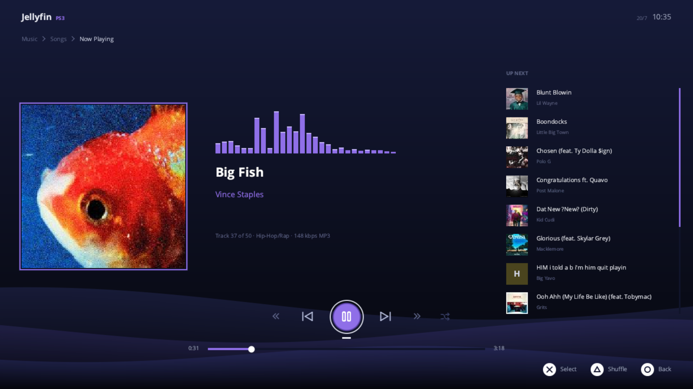

<div align="center">
  

  # JellyFin PS3

  **A native Jellyfin client for the PlayStation 3.**

  Play your whole Jellyfin library, movies, TV and music, straight from the couch.
  It's built to feel like it belongs on the console instead of a web page squeezed
  onto a TV.

  [](../../releases/latest)
  [](LICENSE)

  C/C++ · PSL1GHT · Evilnat CFW / HEN

</div>

---

## Screenshots

<div align="center">

**Home**



**Movies**



**Now Playing (Music)**



</div>

---

## What it does

- **Movies, TV, Collections and Music.** Everything shows up as poster and still
  card grids, with an A-Z jump bar and scrollbars so you always know where you are
  in a big library.
- **A home shelf** that mirrors the Jellyfin web app, with Continue Watching, Next
  Up, and Recently Added rows.
- **Hardware H.264 playback** through the PS3's VDEC. The display loop runs at a
  smooth 60 fps and blends frames so 24 fps content doesn't judder.
- **AV sync stays locked to within ±5 ms** off the audio clock.
- **Resume and progress reporting.** Stop watching on the PS3 and it shows up as
  Continue Watching everywhere else. The next episode auto-advances, too.
- **An in-player HUD** with a seek bar, transport controls, and audio/subtitle
  track menus. Subtitles are burned in on the server side.
- **Seek, skip and scrub.** Tap to jump 10 seconds, or hold to scrub the bar.
- **A full music player.** Albums, Artists, Playlists, Genres and Songs, a play
  queue with shuffle, and a Now Playing screen whose 28-band spectrum visualizer
  actually reacts to what you're hearing.
- **Live search**, an on-screen keyboard, item info overlays, and a thumbnail cache
  that keeps browsing quick.
- **An update check at launch** that pops up quietly when a newer release is out.

---

## Requirements

- A PS3 running **Evilnat CFW** or **HEN** (CEX)
- A **Jellyfin server** the console can reach (a local network is easiest)
- To build it yourself: the **PSL1GHT toolchain** (`ppu-gcc` under
  `/usr/local/ps3dev/`) and `sfo.xml` at `~/ps3dev/ps3py/sfo.xml`, which the
  `.pkg` target uses

---

## Install

Grab `JellyFin---PS3.pkg` from the [latest release](../../releases/latest) and
install it. If you'd rather run the `.self` directly, copy it over FTP or USB and
launch it through webMAN or multiMAN.

## Build from source

```bash
make clean && make      # SELF only
make pkg                # installable PKG
```

That gives you `JellyFin---PS3.self` and `JellyFin---PS3.pkg`.

> Cutting a release? Bump `APP_VERSION` in `source/net/update_check.h` to match the
> release tag so the update check compares against the right number.

---

## Controls

**Menus.** `X` select · `O` back · `D-pad` navigate · `L1`/`R1` switch tabs ·
`△` item info. In Music, press `Up` from the top row to reach the sub-tab header.

**Video player.** Press any button to bring up the HUD (it hides itself again after
4 seconds). `Left`/`Right` move across the control row and `X` activates whatever's
focused. `R2`/`L2` tap to skip ±10 seconds, or hold to scrub. `Start` stops. During
the last-90-seconds prompt, `Select` jumps to the next episode.

**Music player.** `Left`/`Right` move across the transport row, and going `Right`
past Shuffle drops you into the UP NEXT queue. `L1`/`R1` are previous/next track,
`△` toggles shuffle, `R2`/`L2` seek, and `Select` opens the full-queue overlay.

**Search.** Type on the on-screen keyboard, press `Down` to jump into the results,
and `△` to toggle caps.

<details>
<summary>Full button reference</summary>

### Menus

| Button   | Action                                             |
|----------|----------------------------------------------------|
| X        | Select / confirm                                   |
| O        | Back                                               |
| D-pad    | Navigate                                           |
| L1 / R1  | Cycle tabs (prev/next page in the season browser)  |
| Triangle | Item info overlay                                  |

### Video player

| Button          | Action                                                            |
|-----------------|-------------------------------------------------------------------|
| Start           | Stop / exit player                                                |
| Left / Right    | Move focus across the control row (Rew · Play/Pause · FF · AUDIO · CC) |
| X               | Activate the focused control                                      |
| R2 / L2 (tap)   | Skip +10 s / -10 s (taps within 1 s batch into one seek)          |
| R2 / L2 (hold)  | Pause and scrub the seek bar; seek fires once on release          |
| Select          | Jump to the next episode/movie (during the NEXT prompt, last 90 s)|

### Music player

| Button             | Action                                                        |
|--------------------|---------------------------------------------------------------|
| Left / Right       | Move focus across the transport row                           |
| Right past Shuffle | Enter the UP NEXT queue                                        |
| Up / Down (queue)  | Scroll the full remaining queue                               |
| X                  | Activate control / play the highlighted queue track           |
| Triangle           | Toggle shuffle                                                 |
| L1 / R1            | Previous / next track (previous restarts when >3 s in)        |
| R2 / L2            | Seek (tap batches, hold scrubs)                               |
| Select             | Full-queue overlay                                            |
| O / Start          | Stop playback and return to the library                       |

### Search

| Button    | Action                                  |
|-----------|-----------------------------------------|
| D-pad     | Move cursor on keyboard / in results    |
| X         | Type character / play result            |
| Triangle  | Toggle caps lock                        |
| O / CLEAR | Reset search, return to keyboard        |
| Down      | Jump from keyboard to results           |
| Up        | Jump from first result back to keyboard |

</details>

---

## How it works

The architecture leans heavily on [Movian](https://github.com/andoma/showtime).
Its media player was the reference the whole app was built from.

**Video.** An HTTP MPEG-TS transcode stream gets demuxed on a decode thread. H.264
access units go to the PS3 VDEC (SPU-accelerated), decoded frames land in a 16-slot
jitter buffer, and a Movian-style 60 fps display loop blits them through the RSX. A
crossfade shader blends between decoded 24 fps frames using a Bresenham accumulator
locked to hardware vsync, which is what kills the usual 2:3 pulldown judder.

**Audio.** MP3 gets decoded with minimp3 into a PCM ring and pushed to the PS3 audio
DMA at 48 kHz. The audio PTS drives the master clock, and an EMA keeps AV sync inside
±5 ms.

**Seeking.** Jellyfin's transcode isn't byte-seekable, so seeks copy Movian's
flush-and-reopen path: stop the decode thread, flush the decoder, audio and jitter
buffer, re-request the stream at the new `StartTimeTicks`, then resume. The audio
clock re-seeds from the new segment, so the seek bar snaps to the right spot on its
own.

**Music.** The music player reuses the same audio port through a pluggable PCM
source that pulls Jellyfin's audio transcode endpoint. The spectrum visualizer taps
samples at the DMA read cursor rather than at decode time, so the bars match what's
coming out of the speakers instead of what's buffered a fraction of a second ahead.

<details>
<summary>Deeper technical notes (pipelines, HUD, threading, file layout)</summary>

### Video pipeline

```
HTTP stream (MPEG-TS)
        |
        v
  Decode thread: stream_read() -> 188-byte TS packets -> video_feed_ts()
  TS demuxer -> PAT/PMT -> PES reassembly
        |
        +- Audio PES -> adec_push_pes() -> minimp3 -> PCM ring
        |
        +- Video PES -> vdecDecodeAu() -> VDEC (SPU H.264)
                |
                v
         VDEC callback: vdec_pull_frame() -> YUV -> ARGB
                |
                v
         Jitter buffer (16 slots, ~28 MB at 720p, PTS + duration per slot)
                |
                v
         Upload thread -> RSX-local texture (double-buffered, A + B for blend)
                |
                v
         Display loop (60fps): Bresenham gate + gcmSetVBlankHandler @ 59.94 Hz
                |
                v
         RSX blit: crossfade shader blends A -> B mid-pulldown, flip()
```

- **FPS detection:** VDEC `frame_rate_code` maps to exact fractional fps
  (ISO 13818-2); refresh rate comes from `videoGetState` (59.94 Hz).
- **Temporal blending:** each frame carries a remaining duration. When it drops
  below one vblank and the next frame is ready, the shader crossfades on the
  fractional remainder, so there's no fixed pulldown pattern to fight.
- **AV sync:** `avsync_compute_diff()` takes video PTS minus audio PTS and smooths
  it with an EMA; each vblank period gets nudged ±5000 µs to correct drift. It's
  locked once that stays below ~41.6 ms.

### Seek pipeline

Modelled on Movian's `mp_flush` reposition path:

```
Compute target = audio_clock + delta -> Jellyfin 100-ns ticks (StartTimeTicks)
Stop decode thread (audio + upload keep running, idle on empty buffers)
Flush: vdec_flush() · adec_flush() · jbuf_clear() · video_reset_demux() · avsync_reset()
Re-request stream at new StartTimeTicks -> re-prefill jitter buffer
Respawn decode thread -> resume (audio clock re-seeds from new segment)
```

`SEEK_REOPEN_VDEC` swaps the decoder reset for a full close/open rebuild. It's
slower but bulletproof, handy for A/B testing on hardware.

### HUD overlay

The in-player HUD gets composed by the CPU into a staging buffer **only when its
content changes**, uploaded to an RSX texture, and then drawn each frame as one
alpha-blended quad over the video. That way a visible seek bar costs the display
loop almost nothing. Getting there took a few tries: a vertex-array quad that froze
the console on pause, a CPU framebuffer blend that tanked to ~5 fps, and a per-frame
CPU draw that halved the frame rate. The earlier dim-strip paths are still kept
behind compile defines for hardware testing:

| Define            | Path                                                  |
|-------------------|-------------------------------------------------------|
| (none, default)   | Inline GPU quad, fast and freeze-proof                |
| HUD_DIM_CPU       | CPU pixel blend, slow but bulletproof fallback        |
| HUD_DIM_GPU_ARRAY | Original array-fetch quad, known to freeze, test only |

While paused with no input, the display loop stops redrawing altogether. The frame
is pixel-identical anyway, so it just polls input at vblank rate until something
changes.

### Audio & burned-in subtitles

Picking a subtitle track flips the server to `SubtitleMethod=Encode`, which
front-loads several seconds of audio while the subtitle-burning encoder warms up. A
256-slot PES queue holds that burst compressed and the decoder back-pressures on the
PCM highwater, so nothing gets dropped and playback stays in sync. It used to skip
about 10 seconds ahead on real hardware before this fix.

### Threading model

| Thread         | Priority | Role                                                     |
|----------------|----------|----------------------------------------------------------|
| Display (main) | default  | Bresenham gate, RSX blit, flip, input poll, seek control |
| Decode         | 800      | TS demux, VDEC submit, jitter buffer fill                |
| Upload         | 850      | memcpy jitter buffer to RSX texture (A + B)              |
| Audio          | 750      | DMA event loop, PCM ring drain                           |
| Progress       | 1100     | POST position to Jellyfin every ~10 s                    |
| Async log      | 1200     | Ring-buffer drain to `player_log.txt` (when enabled)     |

On a seek, only the decode thread gets stopped and respawned.

### Source layout

```
source/
|-- api/      Jellyfin REST surface (auth, browse, detail, playstate)
|-- audio/    Audio port + DMA ring, minimp3 decode
|-- cache/    Thumbnail caching
|-- gfx/      RSX helpers, shaders, embedded fonts, stb_image/truetype
|-- music/    Audio-only engine, FFT visualizer, Now Playing screen
|-- net/      HTTP client, GitHub update check
|-- player/   Core loop, HUD, GPU draw, decode/upload/audio threads, TS stream
|-- ui/       XMB UI: input, OSK, home shelf, browse, search, settings, rendering
|-- util/     Frame pacing / AV sync, async logging
`-- video/    Session glue, TS demux, VDEC, jitter buffer
```

</details>

---

## Logging

Debug logging is **off by default** and you toggle it from the Settings tab. That
choice sticks across restarts in `/dev_hdd0/tmp/jellyfin_settings.txt`. When it's on,
output goes to `/dev_hdd0/tmp/player_log.txt`. A crash log always gets written
synchronously to `/dev_hdd0/tmp/crash_log.txt`, and the launch update check leaves
its own trace in `/dev_hdd0/tmp/update_detection.txt`.

---

## Acknowledgments

- **[Movian](https://github.com/andoma/showtime)** (formerly Showtime). The whole
  app was built using Movian's media player as a reference. The video display loop,
  the temporal frame blending, and the flush-and-reopen seek path all follow how
  Movian does it. Big thanks to Andreas Öman and everyone who's worked on it.
- **[ps3dev](https://github.com/ps3dev)** for keeping
  **[PSL1GHT](https://github.com/ps3dev/PSL1GHT)** alive: the SDK, toolchain, and
  libraries that make open PS3 homebrew possible in the first place. PSL1GHT is
  MIT-licensed, Copyright (c) 2011 PSL1GHT Development Team.
- The authors of the embedded libraries (minimp3, stb_image, stb_truetype), and the
  Jellyfin project itself.

---

## License

JellyFin PS3 is free software licensed under the **GNU General Public License v3.0**
(or, at your option, any later version). The full text lives in the
[LICENSE](LICENSE) file.

Copyright (C) 2026 Montague McKeefry

This program is distributed in the hope that it will be useful, but WITHOUT ANY
WARRANTY; without even the implied warranty of MERCHANTABILITY or FITNESS FOR A
PARTICULAR PURPOSE. See the GNU General Public License for more details.

Bundled third-party components keep their own licenses. The main one is the PSL1GHT
SDK (MIT), which is GPLv3-compatible.
